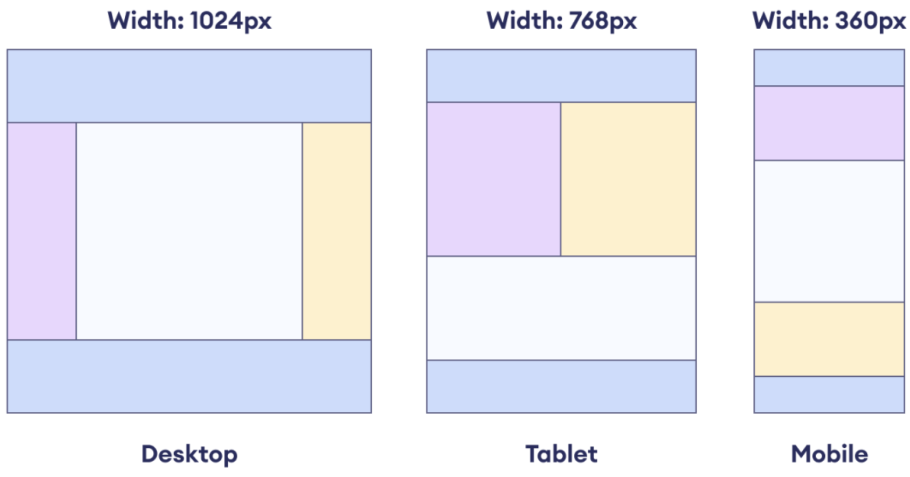

# html-responsive

A basic HTML/CSS responsive layout exercise. Just follow these steps:

1. Download the `index.html` and `styles.css` file. 
2. Add your styles the `styles.css` document to make the HTML responsive.
3. Use this layout as a guide:

    

